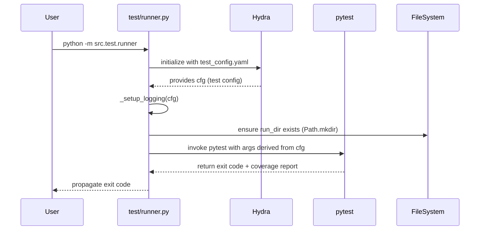

# HINT Test Suite – Design (design.md)

This document describes the technical design for the HINT test suite refactor.  
It connects the requirements in `requirements.md` to a concrete architecture that respects:

- Domain-Driven Design (DDD) layering
- FIRST testing principles
- Zero-comment, English-only documentation
- Centralized logging/telemetry and configuration

---

## 1. High-level Architecture

The test suite mirrors the production DDD layout under `src/hint`:

```text
src
├─ hint
│  ├─ app
│  ├─ domain
│  ├─ foundation
│  ├─ infrastructure
│  └─ services
└─ test
   ├─ unit
   ├─ integration
   ├─ e2e
   ├─ utils
   └─ runner.py
```

### 1.1 DDD Layer ↔ Test Layer Mapping

- **Foundation tests** (`src/test/unit/foundation/**`)  
  Validate value objects, configs, DTOs, exceptions, and interfaces.

- **Domain tests** (`src/test/unit/domain/**`)  
  Validate domain entities and domain value objects (`entities.py`, `vo.py`) without infrastructure concerns.

- **Infrastructure tests** (`src/test/unit/infrastructure/**`)  
  Validate components, data sources, networks, registries, and telemetry, typically with heavy mocking of I/O and external systems.

- **Application tests** (`src/test/unit/app/test_factory.py`)  
  Validate the wiring of the application layer (`factory.py`) and that dependencies are created according to configuration.

- **Service tests – ETL / ICD / Training**  
  - `src/test/unit/services/etl/**`  
  - `src/test/unit/services/icd/**`  
  - `src/test/unit/services/training/**`  
  Validate service orchestration and behavior at the service-level boundary, including edge cases and exceptions.

- **Integration tests** (`src/test/integration/**`)  
  Validate cross-layer workflows (e.g., datasource ↔ persistence ↔ networks, and ETL / training workflows) within a constrained environment.

- **End-to-end tests** (`src/test/e2e/**`)  
  Validate CLI entrypoints (`main.py`, `factory.py`) and full workflows at a black-box level using synthetic or reduced datasets.

This mapping enforces a **clear separation of concerns** and enables **layer-specific test strategies** while targeting 100% coverage on `src/hint`.

---

## 2. Test Runner & Configuration Design

### 2.1 Runner Entry Point (`src/test/runner.py`)

The test runner is the single entry point for executing the suite in CI and locally.  
It is implemented as a Hydra-driven CLI rather than using `argparse`.

Key responsibilities:

1. **Hydra config bootstrap** using `test_config.yaml`.
2. **Logging setup** for Loguru and Rich.
3. **Environment and path preparation** using `pathlib.Path`.
4. **Delegation to pytest** with the appropriate test selection and configuration.

The runner’s main function is decorated with `@hydra.main(config_path="...", config_name="test_config")` to retrieve configuration from `configs/test_config.yaml`.

### 2.2 Hydra Test Configuration (`configs/test_config.yaml`)

`test_config.yaml` centralizes:

- Test root paths (e.g., `test_root: "src/test"`).
- Target subsets (e.g., `run_unit: true`, `run_integration: true`, `run_e2e: true`).
- Coverage settings (e.g., target modules, omit patterns).
- Logging configuration:
  - Log levels (`DEBUG`, `INFO`, `WARNING`) for tests.
  - Hydra `run.dir` for storing logs and coverage artifacts.
- Feature toggles (e.g., enabling slow / long-running tests only in specific profiles).

The runner uses these configuration values to:

- Build a list of pytest arguments (e.g., `["-m", "unit", "src/test/unit"]`).
- Select coverage modules (e.g., `--cov=src/hint`).
- Enable or disable specific test groups (e.g., training integration tests).

### 2.3 Runner Sequence of Operations



The design ensures that **all test execution flows through the same configuration and logging pipeline**, guaranteeing uniform behavior across local and CI environments.

---

## 3. Logging & Telemetry Design

### 3.1 Loguru + Rich Coexistence

The logging design is centered on **non-conflicting, layered logging sinks**:

- **Loguru**: Structured logging to files under Hydra-managed `run.dir`.
- **Rich**: Human-friendly logging and progress visualization in the terminal.

In `_setup_logging` inside `runner.py`:

1. Remove default Loguru handlers (`logger.remove()`).
2. Add:
   - A **file sink** pointing to `${hydra.run.dir}/test.log` (or similar path) using `Path` objects.
   - A **console sink** adapted to Rich’s `Console`, configured with a simple log format suitable for concurrent Rich progress bars.
3. Configure logging level based on `cfg.logging.level`.

This satisfies the requirement that **comments are replaced by stage-aware logging** and that **Loguru and Rich do not interfere**.

### 3.2 Telemetry Infrastructure (`infrastructure/telemetry.py`)

The `RichTelemetryObserver` (and related telemetry utilities) provides a testable abstraction for progress and metric logging:

- Wraps a Rich `Console` and optional progress bars.
- Offers methods such as:
  - `log_metric(name: str, value: float, step: int)`
  - `log_params(params: Dict[str, Any])`
  - `log_stage(stage_name: str)`

In tests (`src/test/unit/infrastructure/test_telemetry.py`):

- The telemetry observer is instantiated with **mocked sinks** (e.g. mocked `Console` and `logger`).
- Calls to `log_metric` and `log_params` are verified via the mock calls.
- Coexistence with Loguru is tested by ensuring that enabling both telemetry and file logging does not raise errors.

This design makes observability **first-class** and **fully testable**.

---

## 4. Path Handling and File System Design

### 4.1 Pathlib-only Policy

All test code and runner utilities use `pathlib.Path` to manage filesystem paths:

- Directories:
  - `Path("data") / "processed"` instead of `os.path.join("data", "processed")`.
  - `path.mkdir(parents=True, exist_ok=True)` instead of `os.makedirs`.
- Files:
  - `path.open("r")` / `path.open("w")` instead of `open(path_str, ...)`.

Common path entrypoints:

- `PROJECT_ROOT` inferred from `Path(__file__).resolve().parents[...]`.
- `TEST_ROOT = PROJECT_ROOT / "src" / "test"`.
- `CONFIG_ROOT = PROJECT_ROOT / "configs"`.

This ensures **deterministic, OS-agnostic behavior** and aligns with the requirements on Pathlib usage.

---

## 5. Test Structure & Fixture Design

### 5.1 Global Fixtures

`src/test/conftest.py` provides **global fixtures** and pytest configuration:

- Seed setting for deterministic behavior (e.g., `set_seed` fixture).
- Temporary directory fixtures based on `tmp_path` for ETL artifacts.
- A global `telemetry` fixture, providing a preconfigured `RichTelemetryObserver` for tests that need it.

### 5.2 Layer-specific Fixtures

- `src/test/unit/conftest.py`  
  Provides fixtures focused on **unit-level** concerns:
  - Minimal configs for foundation & domain tests.
  - Simple in-memory stub objects instead of full infrastructure.

- `src/test/integration/conftest.py`  
  Provides fixtures for **integration workflows**:
  - Small synthetic datasets (via `utils/synthetic_data.py`).
  - Temporary HDF5 files.
  - Registry and datasource wiring using the actual infrastructure components where appropriate.

### 5.3 Utility Modules

- `src/test/utils/custom_assertions.py`  
  Offers specialized assertion helpers, such as:
  - `assert_logs_contain(recorded_logs, "Expected substring")`
  - `assert_metrics_close(actual, expected, tol)`

- `src/test/utils/synthetic_data.py`  
  Provides functions for generating synthetic ETL inputs and model inputs:
  - Minimal patient time-series.
  - Small, deterministic static tables.
  - Controlled corrupt HDF5 files for error-handling tests.

This design **centralizes complex setup logic** and avoids duplication across test modules.

---

## 6. Behavior-focused Test Design per Layer

### 6.1 Foundation Layer Tests

Files:

- `src/test/unit/foundation/test_configs.py`
- `src/test/unit/foundation/test_dtos.py`
- `src/test/unit/foundation/test_exceptions.py`

Responsibilities:

- Verify that:
  - Configs parse and validate configuration structures correctly.
  - DTOs behave as simple, immutable carriers of structured data.
  - Exceptions provide precise error types for validation, configuration, and infrastructure failures.

Design:

- Use synthetic config dictionaries or Hydra configs.
- Assert that invalid inputs raise domain-specific exceptions (e.g. `ConfigurationError`, `DataValidationError`).

### 6.2 Domain Layer Tests

Files:

- `src/test/unit/domain/test_entities.py`
- `src/test/unit/domain/test_vo.py`

Responsibilities:

- Validate **pure domain logic**: invariants, derived properties, value equality, and transformations.

Design:

- Use **pure Python tests** without touching I/O, configs, or frameworks.
- Ensure full branch coverage over domain invariants and error cases.

### 6.3 Infrastructure Layer Tests

Files:

- `src/test/unit/infrastructure/test_components.py`
- `src/test/unit/infrastructure/test_datasource.py`
- `src/test/unit/infrastructure/test_networks.py`
- `src/test/unit/infrastructure/test_registry.py`
- `src/test/unit/infrastructure/test_telemetry.py`

Responsibilities:

- Validate low-level implementation details:
  - Data loading and saving (with mocks for actual storage).
  - Model network construction and forward passes.
  - Registry lookups for components.
  - Telemetry behavior and logging.

Design highlights:

- **Datasource tests**:
  - Use temporary directories and synthetic files to verify reading and writing.
  - Include corrupted-file scenarios to ensure controlled failures (per R-15).

- **Network tests**:
  - Use small synthetic tensors.
  - Avoid training loops; only forward passes and shape/value checks.

- **Telemetry tests**:
  - Use mocks to assert that metrics and parameters are logged as expected.
  - Validate no conflict between terminal and file logging.

### 6.4 Service Layer Tests (ETL / ICD / Training)

- ETL: `src/test/unit/services/etl/components/test_*.py`
- ICD: `src/test/unit/services/icd/test_service.py`
- Training: `src/test/unit/services/training/test_trainer.py`, `test_evaluator.py`

Responsibilities:

- Validate **business-level workflows** such as:
  - ETL pipelines that transform raw inputs into model-ready tensors.
  - ICD coding services that orchestrate text encoders and classifiers.
  - Training loops that coordinate data, models, optimizers, evaluators, and telemetry.

Design for critical edge cases:

- **Training**:
  - `test_train_handle_nan_loss`: simulate `NaN` loss and assert safe failure behavior.
  - `test_train_empty_dataloader`: simulate empty dataloader and assert explicit error or graceful exit.

- **ETL**:
  - `test_missing_required_columns`: build minimal Parquet tables missing key columns and assert domain-specific `DataValidationError`.
  - `test_invalid_config_paths`: misconfigure paths in a local Hydra config override and assert `FileNotFoundError` or `ConfigurationError`.

- **ICD**:
  - Use small synthetic note corpora and minimal vocabularies.
  - Mock heavy components (e.g. BERT encoder) where needed to maintain fast test runs.

### 6.5 Integration & E2E Tests

- Integration:
  - `src/test/integration/infrastructure/test_hdf5_datasource.py`
  - `src/test/integration/infrastructure/test_model_persistence.py`
  - `src/test/integration/workflows/test_etl_execution.py`
  - `src/test/integration/workflows/test_full_training_loop.py`

- E2E:
  - `src/test/e2e/test_cli_entrypoint.py`

Responsibilities:

- Integration tests: verify **multi-component workflows** using real implementations but small datasets.
- E2E tests: verify **CLI entrypoints and complete pipelines** in a black-box manner.

Design:

- Use Hydra configs to point to tiny synthetic datasets instead of real MIMIC data.
- Capture `stdout`/`stderr` via `subprocess` in E2E tests and assert presence of expected keywords and exit codes.
- Ensure all E2E and integration tests are **self-validating**, with no manual log inspection required.

---

## 7. Documentation & Style Design

### 7.1 Docstring Template

Every test function and class uses a **structured docstring** with:

- Short summary line.
- Detailed description with component, scenario, expected outcome.
- `Test Case ID` and `Scenario` labels.
- `Args` and `Returns` sections.

Example pattern (used uniformly with customized content per test):

```python
def test_example_behavior():
    """
    Verify example behavior for the target component.

    This test validates the ExampleComponent behavior under the ExampleScenario.
    It ensures that the expected result is produced when the specific condition is met.
    - Test Case ID: TC-EXAMPLE-001
    - Scenario: ExampleScenario

    Args:
        None

    Returns:
        None
    """
    ...
```

This achieves:

- Compliance with the **zero-comment policy**.
- High readability and traceability from requirements → design → implementation.

### 7.2 No Comments, English-only Policy

- All explanatory content is either in:
  - Docstrings (in English), or
  - Logging statements (in English).
- There are **no inline or block comments** in test files.

This aligns directly with the requirements document and simplifies static enforcement (regex checks for `#`).

---

## 8. Coverage & Tooling Design

### 8.1 Coverage Configuration

Coverage is orchestrated via:

- Pytest’s `--cov` options configured by `test_config.yaml`.
- A shared coverage configuration (either via `pyproject.toml` or explicit CLI args) that:
  - Targets `src/hint/**`.
  - Excludes non-essential files (e.g. `__init__.py` that only re-export symbols if justified).

### 8.2 Continuous Integration Flow

In CI:

1. Invoke `python -m src.test.runner` with the default Hydra profile.
2. Runner configures logging and paths.
3. Runner invokes pytest with:
   - Path selection (unit, integration, e2e).
   - Coverage options.
4. CI pipeline reads coverage report and enforces:
   - 100% statement and branch coverage threshold on `src/hint`.

This loop ensures **early detection of regressions** and maintains the coverage guarantees defined in `requirements.md`.

---

## 9. Phase-wise Refactoring Design

The implementation follows four phases, each leaving the system in a consistent, green state:

1. **Phase 1 – Infra (Runner & Utils)**  
   - Introduce Hydra-based runner.  
   - Configure Loguru + Rich logging.  
   - Enforce Pathlib usage and zero-comment policy in `runner.py`, `utils`, and top-level `conftest.py`.

2. **Phase 2 – Unit Core (Foundation, Domain, Infrastructure)**  
   - Apply docstring template and zero-comment policy.  
   - Add/adjust tests for configs, DTOs, exceptions, entities, VOs, components, datasource, networks, registry, telemetry.  
   - Reach full coverage for Foundation/Domain/Infrastructure modules.

3. **Phase 3 – Unit Services (ETL, ICD, Training)**  
   - Introduce edge-case and exception tests (NaN loss, empty dataloader, missing columns, invalid paths).  
   - Align docstrings and logging with the global pattern.  
   - Achieve coverage targets for all service modules.

4. **Phase 4 – Integration & E2E**  
   - Strengthen existing integration tests to cover negative paths and edge conditions.  
   - Ensure E2E tests are fully self-validating and independent of manual log checks.  
   - Confirm overall coverage, determinism, and compliance with FIRST and DDD.

Each phase is **incremental** and **non-breaking** with respect to CI: tests remain runnable and passing throughout, while style and coverage constraints tighten progressively.

---
